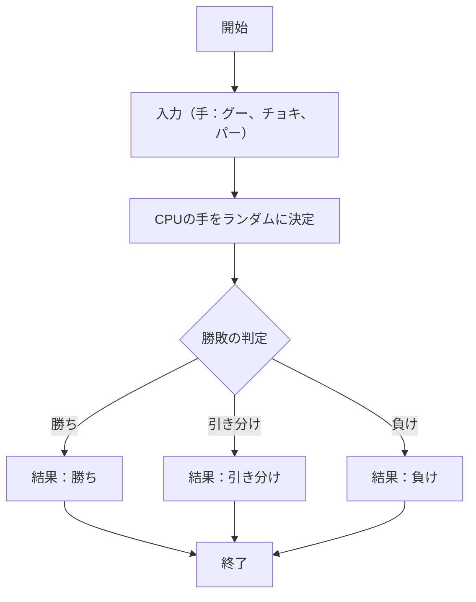
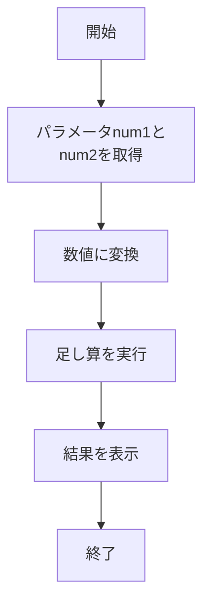
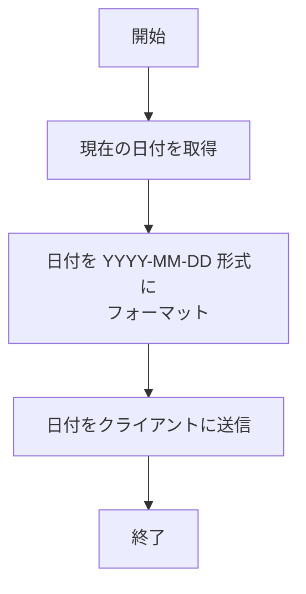
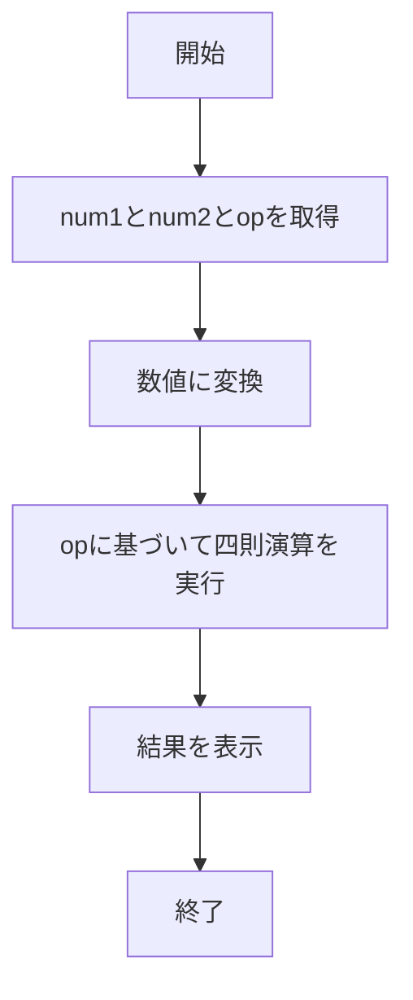

# webpro_06

## このプログラムについて

概要

このプログラムは、簡単なブラウザアプリケーションを提供し、以下のような複数の機能を実現する。

じゃんけんゲーム: プレイヤーとCPUがじゃんけんを行い、勝敗を判定する。

足し算機能: 入力された2つの数値を加算して結果を表示する。

日付表示: 現在の日付を取得してフォーマットされた形で表示する。

四則演算: 入力された数値と演算子に基づいて計算結果を返す。

(1) 起動方法や編集したファイルをGitで管理する
起動方法

1. node app5.js で開発サーバーを起動
2. 下記URLでそれぞれのブラウザにアクセス
3. 足し算: http://localhost:8080/add
4. 四則演算: http://localhost:8080/calc
5. 日付表示: http://localhost:8080/today
6. じゃんけん: http://localhost:8080/janken

編集したファイルのgitでの管理方法
1. git add . 変更をステージングに追加
2. git commit -am 'コメント' 追跡済みのファイルの変更をコミット.また,コミットメッセージを直接指定.
3. git push 変更内容をリモートリポジトリに変更.

## ファイル一覧

ファイル名 | 説明
-|-
app5.js | プログラム本体
views/janken.ejs | じゃんけんの開始画面
views/today.ejs | 日付表示の開始画面
views/add.ejs | 足し算の開始画面
views/calc.ejs | 四則演算の開始画面

## app5.js
じゃんけんの勝ち負け判定

足し算の結果表示

日付の表示

四則演算の結果表示

