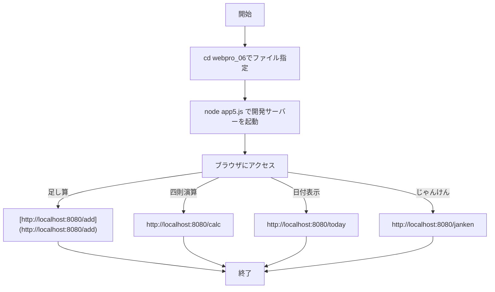
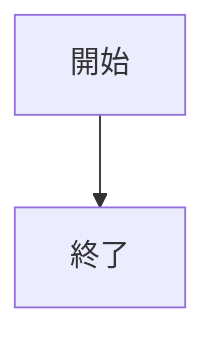
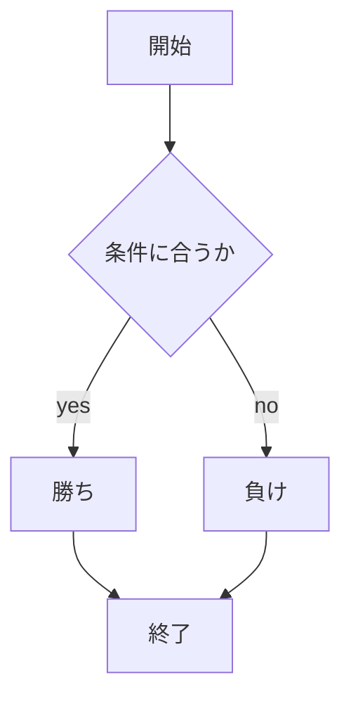
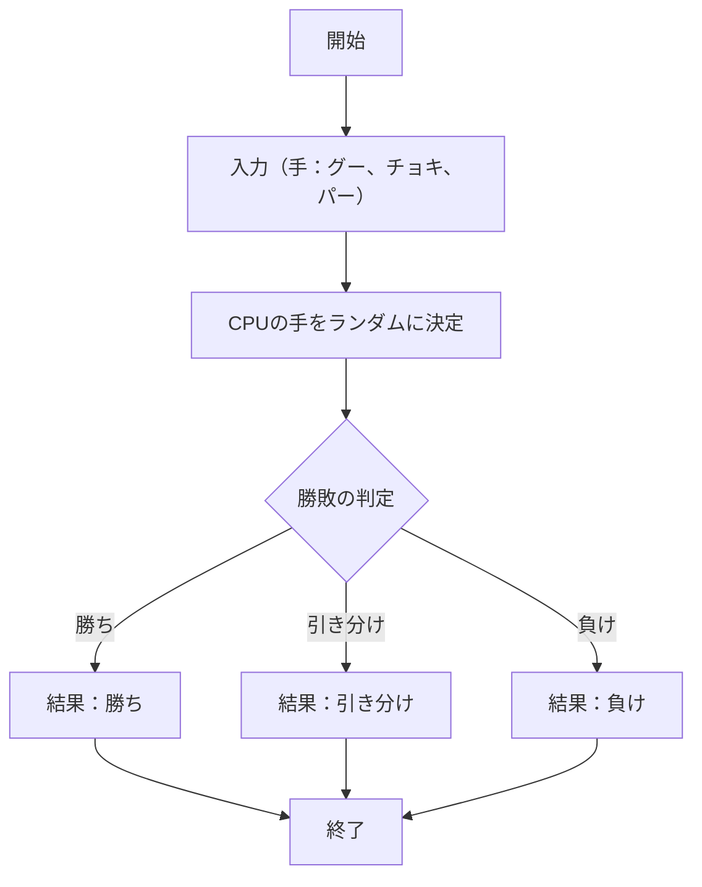
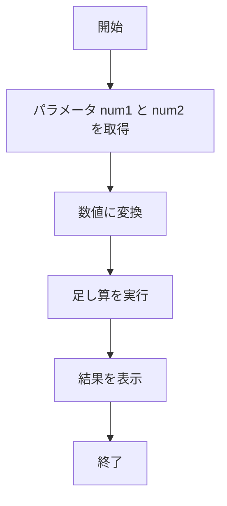
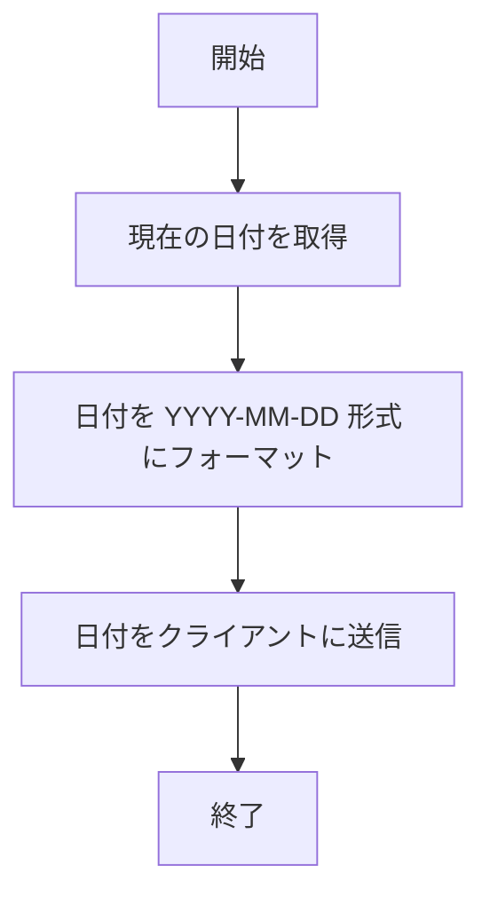
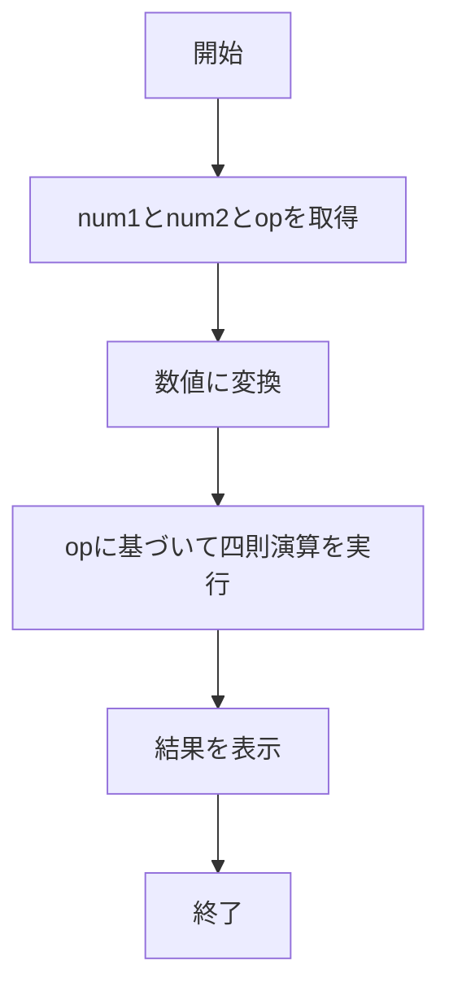

# webpro_06

## このプログラムについて

概要

このプログラムは、簡単なブラウザアプリケーションを提供し、以下のような複数の機能を実現する。

じゃんけんゲーム: プレイヤーとCPUがじゃんけんを行い、勝敗を判定する。

足し算機能: 入力された2つの数値を加算して結果を表示する。

日付表示: 現在の日付を取得してフォーマットされた形で表示する。

四則演算: 入力された数値と演算子に基づいて計算結果を返す。

(1) 起動方法や編集したファイルをGitで管理する
起動方法


ファイルの管理方法


## ファイル一覧

ファイル名 | 説明
-|-
app5.js | プログラム本体
public/janken.html | じゃんけんの開始画面


```javascript
console.log( 'Hello' );
```





## app5.js
じゃんけんの勝ち負け判定


足し算の結果表示

日付の表示


四則演算

